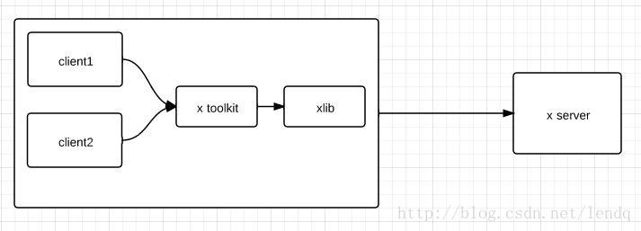

參考资料：https://www.x.org/wiki/guide/concepts/#xisclientserver
X windows 研究笔记：　https://www.doc88.com/p-4774133868874.html?r=1

## 一、X协议
### 1、Ｘ协议设计七条准则
### 2、Ｘ windows 分为三个部分:
* X client
* X server
* X protocol
> x window是采用C/S结构设计的, x server是服务器，处理x client发过来的请求，并将结果返回给clients，它们之间的数据交互格式是由x protocol规定。

> x server管理了键盘、鼠标、显示器、触摸板、显卡等I/O设备，所有窗口、文件和图片都是由x server绘制的。 　　例：键入一个字母G，x server得到这个事件后，会将该事件转发给对应的程序(假使此时对应的应用程序就是某一个client)，client接收到事件后，需要显示这个字母，然后就会发一个请求给x server，要求在xx,xx地方显示一个大小为xx颜色为xx,字体为xx的字母，x server收到请求后，就按照要求把字母c画出来了。

> x window system 使用C/S结构设计的优点:
* 资源统一管理，方便共享。由于x server接管了硬件，client不需要直接使用。x server方便获得输入事件，主动发给各个client。
* 远程显示。一般来说server和client是在同一台电脑上，但是也可以不在不同网络的不同电脑上。这样即使你远程登录，也可以在本机上显示远程端的程序。
* 采用C/S，clinet和server可以解耦。client可以采用任意语言开发，只要符合x protocol要求就可以了。
* 看下图：

* xlib封装了交互内容的打包和解包等操作
* x toolkit实现很多常用的组件，比如说GTK+，QT就是很流行的x toolkit。
* 所以平时开发应用的时候，只需要使用QT等就可以了，无需理会x server等存在。

