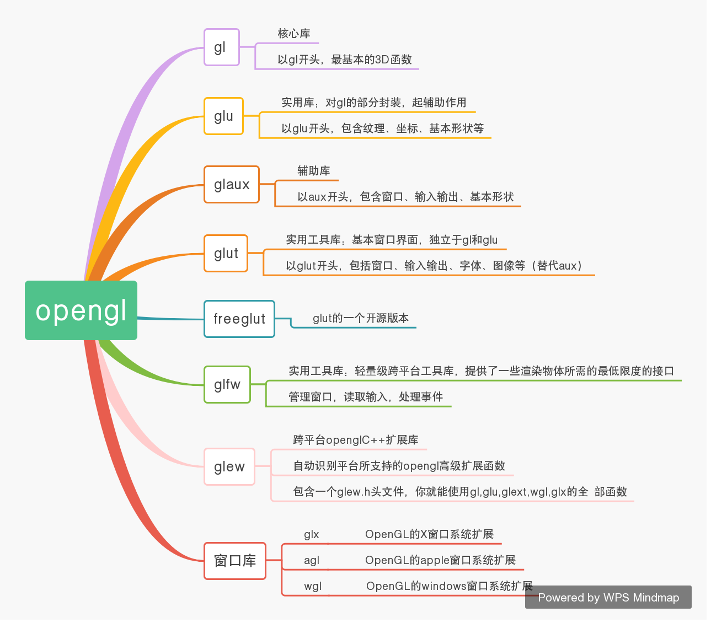

## 1、学习链接
* OpenGL入门学习: http://www.cppblog.com/doing5552/archive/2009/01/08/71532.html

* OpenGL全流程详细解读: https://zhuanlan.zhihu.com/p/56693625

## 2、OpenGL ES 和 EGL 介绍
* https://blog.csdn.net/qjh5606/article/details/95339018

## 3、Opengl各种库之间的关系

